# Making a first bot

This article assumes you've got your Roman up & running or that you will use the instance provided by Wire. For a sake of this simple guide,
we will use Roman running on Wire Staging environment - https://roman.integrations.zinfra.io/swagger. Unfortunately, Roman does not have UI,
so we will need to use Swagger UI provided by the service.

## Requirements

- Wire Team account with admin permissions.
- Roman instance *(you can use public Roman running [here](https://proxy.services.wire.com/))*, in this guide we will be
  using [internal staging Roman](https://roman.integrations.zinfra.io/swagger) with URL `https://roman.integrations.zinfra.io`.
    - Please note that Wire Staging environment is accessible only for the Wire development team and if you create the bot here, you won't
      be able to use it unless you have access to that environment.

## 1. Creating a Developer Account

In order to register a bot in Wire, you need to have a developer account. As of May 2021, every developer account can have exactly one bot.

1. Go to https://roman.integrations.zinfra.io/swagger#/default/register and create an account.
    - click on `Try it out` button
    - fill the JSON with your values
    - click on `Execute`

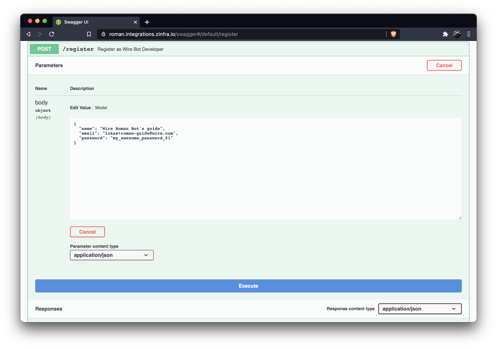

Or execute following `curl` command with your own values.

```bash
curl -X POST 'https://roman.integrations.zinfra.io/api/register' \ 
  -H 'Content-Type: application/json' \  
  -d '{"name": "Wire Roman Bot guide", "email": "lukas+roman-guide@wire.com", "password": "my_awesome_password_#1"}"
```

In both cases you should get following response:

```json
{
  "message": "Email was sent to: lukas+roman-guide@wire.com"
}
```

And following email should appear:
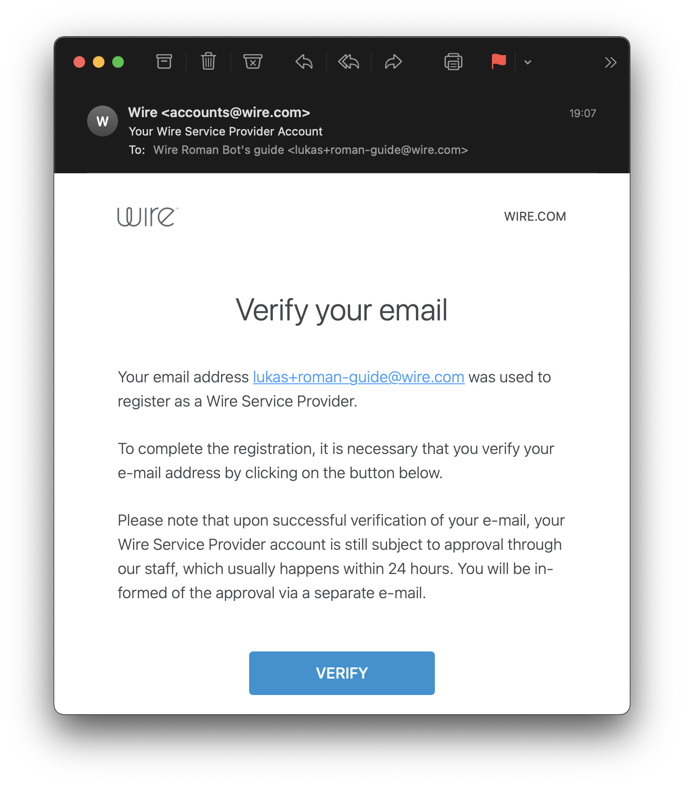

2. Click on `Verify` in the email in order to verify the account creation.
   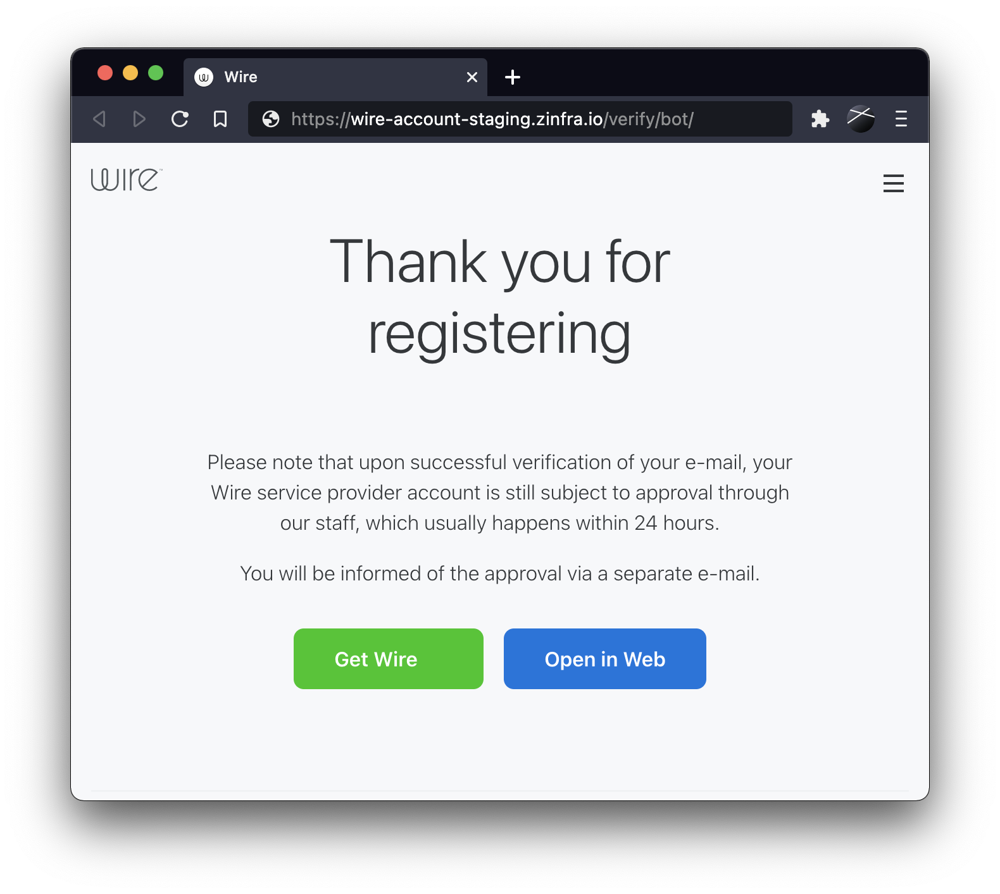
   In a very short time next email should arrive, informing you about the approval as a Wire Service Provider.
   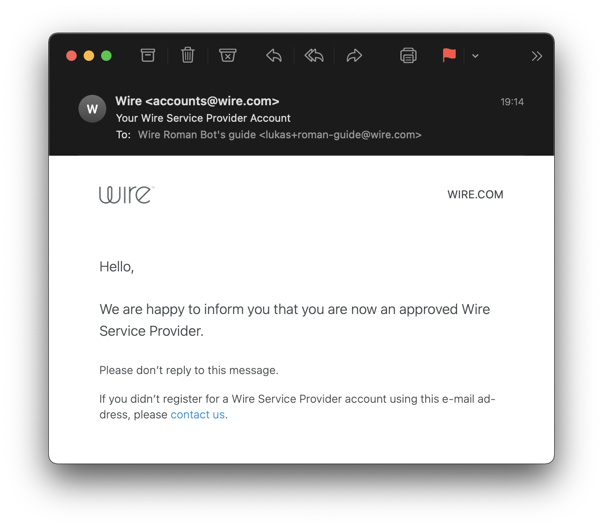

Congratulation, you're now Wire Developer! Let's go create a bot!.

## 2. Developing a Bot

Your bot needs to expose REST API *(or to use websockets)* in order to receive messages from Roman. The very same thing does Roman - exposes
a REST API that allows you to post any data to a conversation your bot is in. To see what APIs need to be implemented and what endpoints
Roman exposes see
[README.md](../README.md) and especially the part
about [payloads](../README.md#events-that-are-sent-as-http-post-to-your-endpoint-webhook-or-websocket).

In this tutorial we implemented as simple bot as possible, just to show how easy that is. For that we
choose [Typescript](https://www.typescriptlang.org/) and [Deno](https://deno.land/) with [Oak](https://oakserver.github.io/oak/). However,
you can choose whatever you want to! As Roman exposes REST API, you can choose whatever tech stack you like and feel comfortable.

Following code is complete and functional Echo bot that uses Roman to receive and send messages to Wire. It echos back to you everything you
write. You can also find the code as [Gist](https://gist.github.com/LukasForst/6e8bfb4170f679aa3c1ec0906580f20a). So let's assume that you
have a file `echo.ts` with the following content:

```typescript
/**
 *  This is a very simple bot, that echos text it receives.
 *  For a sake of simplicity, we don't don any checks and assume only happy scenarios.
 *
 *  We used Deno with Oak, to have a single executable file as short as possible without
 *  any boiler plate.
 *
 *  Run as "deno run --allow-net echo.ts".
 */
import {Application, Context} from 'https://deno.land/x/oak/mod.ts';
// create an Oak Application
const app = new Application();
// register middleware (in our case it's an endpoint)
app.use(async (ctx: Context) => {
    // assume that we're getting a POST/PUT request with JSON payload, for all possible payloads see
    // https://github.com/wireapp/roman#events-that-are-sent-as-http-post-to-your-endpoint-webhook-or-websocket
    const body = await ctx.request.body({type: 'json'}).value;
    // only respond to text events
    if (body.type === 'conversation.new_text') {
        // echo text back to the conversation by responding to a REST call from Roman
        ctx.response.body = {type: 'text', text: {data: `You said: ${body.text.data}`}};
    }
    // respond to all request with status code 200
    ctx.response.status = 200;
});
// start the web server
await app.listen({port: 8080});
```

In order to start your bot, execute `deno run --allow-net echo.ts`. The bot should listen on the `localhost:8080` and should respond to any
requests with correct payload. You can test that with the following `curl`.

```bash
curl localhost:8080 \ 
  --data '{"type":"conversation.new_text", "text": { "data": "Hello World"}}'
```

The bot should respond with:

```bash
{"type":"text","text":{"data":"You said: Hello World"}}
```

## 3. Deploying the Bot

Bot has two options how to receive messages from Roman - either using REST API or by websockets. In this tutorial we created a bot that
exposes REST API. Because Roman needs to somehow reach the bot on some endpoint, the bot needs to be accessible from the public internet
*(or at least on the network where your Roman instance can reach it)*.

So for the following steps to work you need to have a public IP address / DNS record / a URL where the Roman can reach the bot. Either you
can deploy the bot to some VM/Kubernetes or any other hosting service and run it there OR to use a service like [Ngrok](https://ngrok.com/)
that exposes your localhost to the world.

### Docker Deployment

For a first option, we recommend running the bot as a docker container. The most simple Dockerfile might look like this.

```Dockerfile
FROM hayd/alpine-deno
WORKDIR /app
COPY echo.ts .
RUN deno cache echo.ts
EXPOSE 8080
CMD ["run", "--allow-net",  "echo.ts"]
```

In order to run it, use following command - the service will be exposed on the port `8080`.

```bash
docker build -t echo . && docker run -p 8080:8080 --rm echo
```

### Using SSH Tunneling to get DNS

Make sure the bot is up & running on port `8080` (use `curl` Hello World from the previous steps).

To use Ngrok you need to install it and then run

```bash
ngrok http 8080
```

Following output should show up.
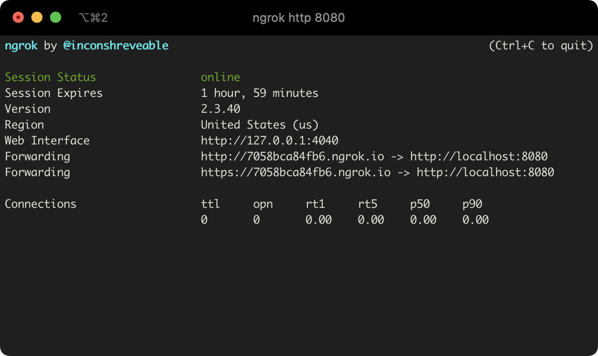
You will get a URL (in our case `https://7058bca84fb6.ngrok.io`) where the service is served. Note that down for the next step.

## 4. Registering a Bot

Now when we have a functional bot with a public URL, we need to register it in Wire. In order to do that, you must do following steps.

1. Go to https://roman.integrations.zinfra.io/api/swagger#/default/login
2. Click on `Try it out`
3. Fill the credentials used in the previous step of this tutorial when you created a Wire Developer account
   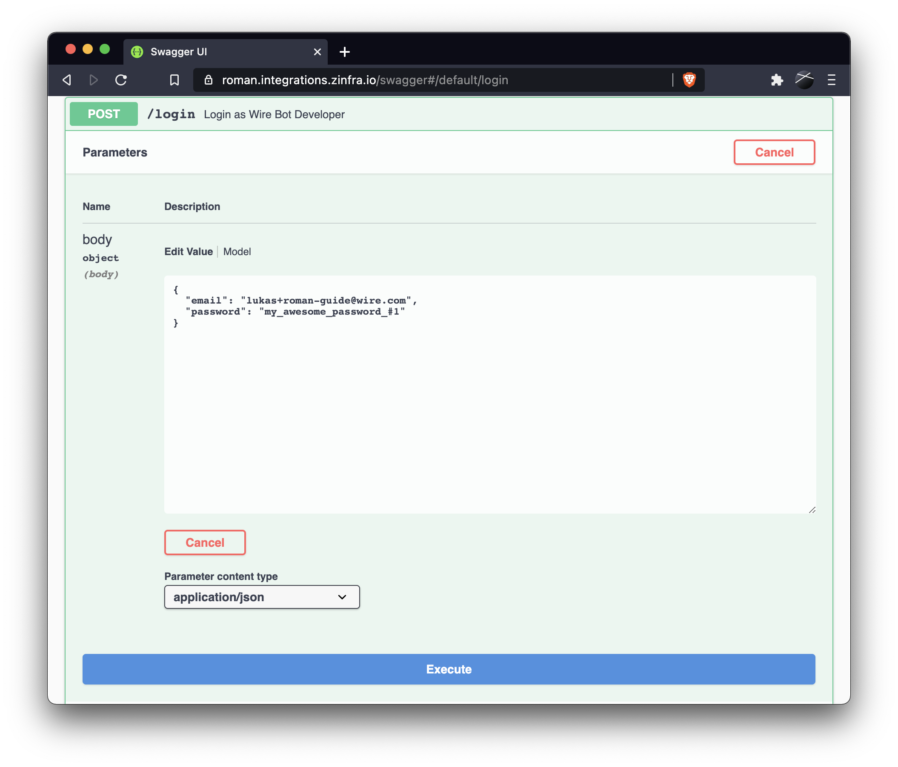
4. Click on `Execute` - now you should be logged in
5. Now you should create a new service - go to `POST /api/service` or click on this
   link https://roman.integrations.zinfra.io/api/swagger#/default/create *(what does it mean is in more detail
   described [in README.md](../README.md#create-a-service) )*
6. Click on `Try it out`
7. Fill the information about your bot, only `name` and `URL` are required - the `URL` is an URL where does the bot listen for requests.
    - in our case the URL is the one from the previous step when we used Ngrok
      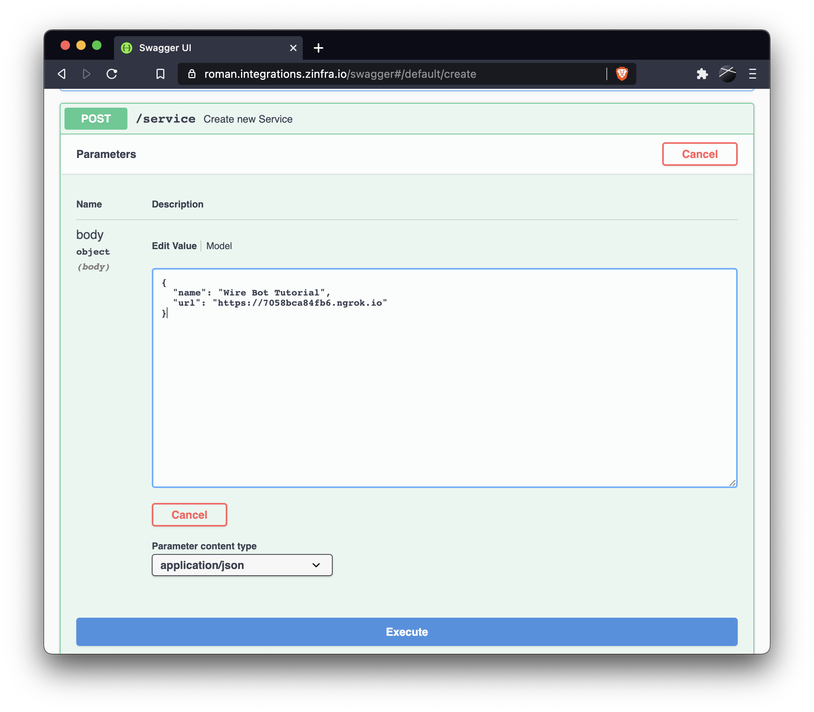
      We used following payload.

```json
{
  "name": "Wire Bot Tutorial",
  "url": "https://7058bca84fb6.ngrok.io"
}
```

8. Hit `Execute` - you should get a response similar to this
   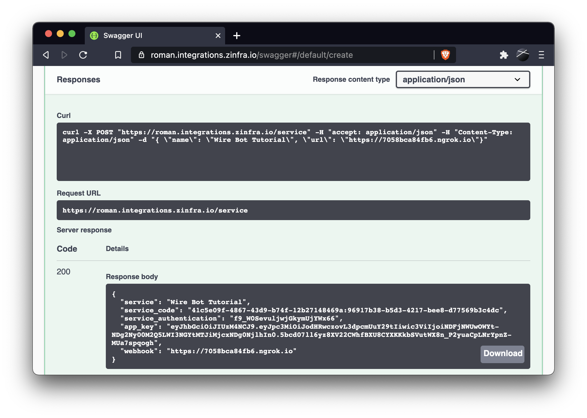

```json
{
  "service": "Wire Bot Tutorial",
  "service_code": "41c5e09f-4867-43d9-b74f-12b27148469a:96917b38-b5d3-4217-bee8-d77569b3c4dc",
  "service_authentication": "f9_W0SevuljwjGkymUjYWx66",
  "app_key": "eyJhbGciOiJIUzM4NCJ9.eyJpc3MiOiJodHRwcz....",
  "webhook": "https://7058bca84fb6.ngrok.io"
}
```

From this JSON you will need the `service_code` *(in our case `41c5e09f-4867-43d9-b74f-12b27148469a:96917b38-b5d3-4217-bee8-d77569b3c4dc`)*
for the next steps. The `service_code` is nothing but the combination of your `ProviderID` and `ServiceID` separated by `:`. `ServiceID` is the id of the service you have just created. `ProviderID` and `ServiceID` are needed in the next step.

## 5. Whitelisting the Bot

Now when the bot us up & running was registered inside Wire, it's time to finally enable it for your Wire Team. Wire bots need to explicitly
whitelisted from the Wire Team admins in the Team Settings.

1. Go to Wire Team Settings *(in our case [Wire Staging](https://wire-teams-staging.zinfra.io/services/))* on tab `Services`
2. Take the `service_code` from the previous step, put it to the field `Enter a service code`
   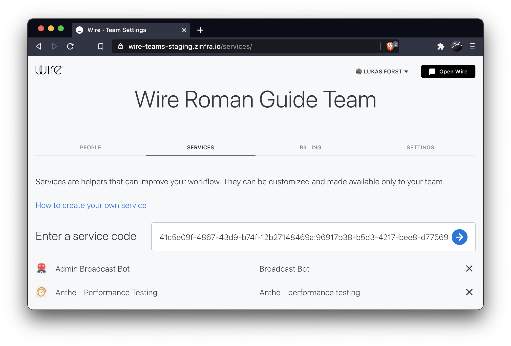
3. Click on the blue arrow - it should show your bot. By clicking on the `Enable service` you whitelist the bot for your team.
   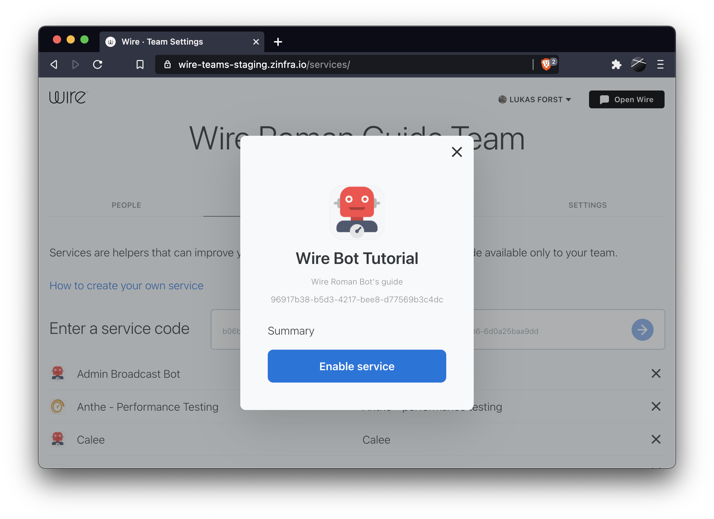

The bot should now be available from the services tab in the Wire Application.

## 6. Using the Bot

If the registration and onboarding process was successful, AND the bot is running, you can add it to a conversation.

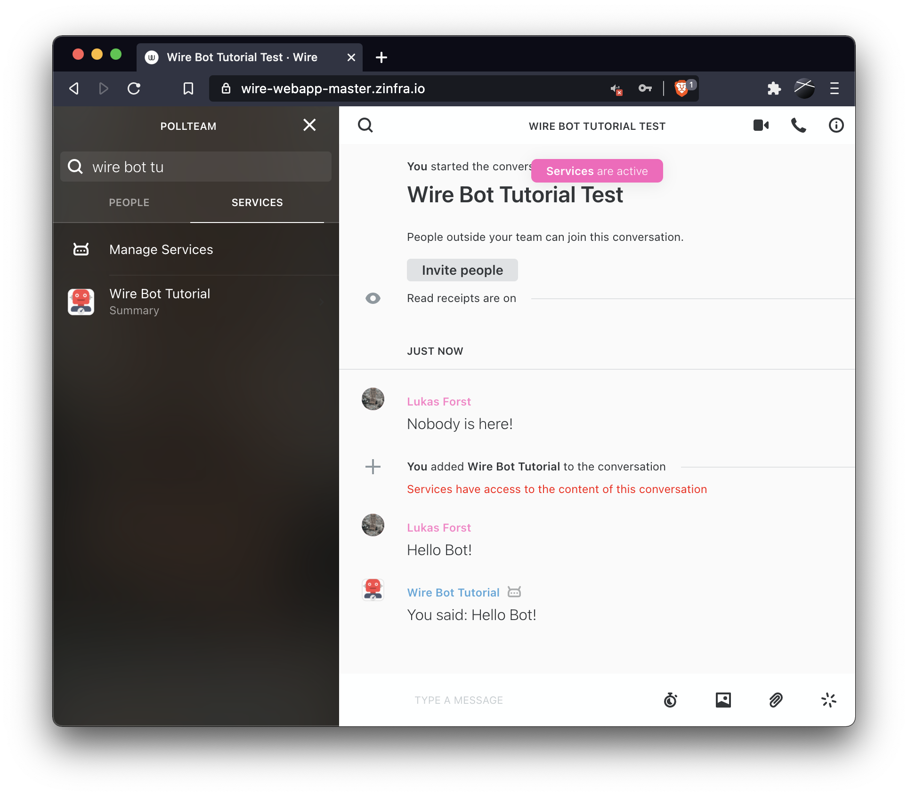
